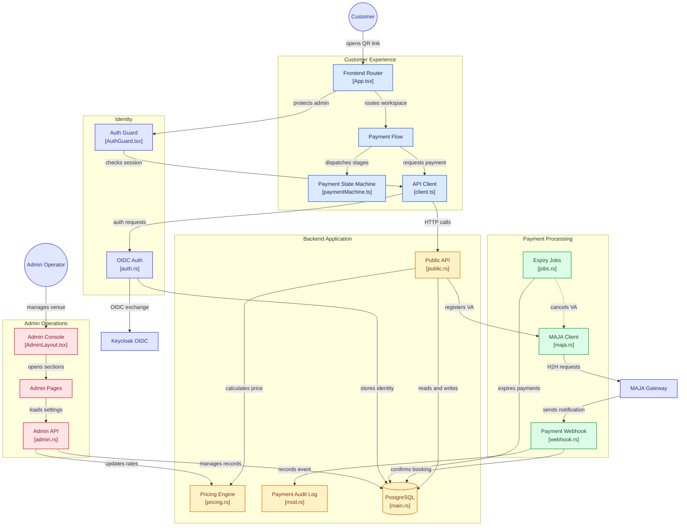

```mermaid

flowchart TD

subgraph group_customer["Customer Experience"]
  node_frontend_app["Frontend Router<br/>[App.tsx]"]
  node_payment_flow["Payment Flow"]
  node_payment_machine["Payment State Machine<br/>[paymentMachine.ts]"]
  node_api_client["API Client<br/>[client.ts]"]
end

subgraph group_backend["Backend Application"]
  node_public_api["Public API<br/>[public.rs]"]
  node_pricing_engine["Pricing Engine<br/>[pricing.rs]"]
  node_audit_log["Payment Audit Log<br/>[mod.rs]"]
  node_postgres[("PostgreSQL<br/>[main.rs]")]
end

subgraph group_payments["Payment Processing"]
  node_webhook_handler["Payment Webhook<br/>[webhook.rs]"]
  node_maja_client["MAJA Client<br/>[maja.rs]"]
  node_expiry_jobs["Expiry Jobs<br/>[jobs.rs]"]
end

subgraph group_admin["Admin Operations"]
  node_admin_console["Admin Console<br/>[AdminLayout.tsx]"]
  node_admin_api["Admin API<br/>[admin.rs]"]
  node_admin_pages["Admin Pages"]
end

subgraph group_identity["Identity"]
  node_auth_guard["Auth Guard<br/>[AuthGuard.tsx]"]
  node_auth_service["OIDC Auth<br/>[auth.rs]"]
end

node_customer_actor(("Customer"))
node_admin_actor(("Admin Operator"))
node_maja_service["MAJA Gateway"]
node_keycloak["Keycloak OIDC"]

node_customer_actor -->|"opens QR link"| node_frontend_app
node_frontend_app -->|"routes workspace"| node_payment_flow
node_payment_flow -->|"dispatches stages"| node_payment_machine
node_payment_flow -->|"requests payment"| node_api_client
node_api_client -->|"HTTP calls"| node_public_api
node_public_api -->|"calculates price"| node_pricing_engine
node_public_api -->|"reads and writes"| node_postgres
node_public_api -->|"registers VA"| node_maja_client
node_maja_client -->|"H2H requests"| node_maja_service
node_maja_service -->|"sends notification"| node_webhook_handler
node_webhook_handler -->|"confirms booking"| node_postgres
node_webhook_handler -->|"records event"| node_audit_log
node_expiry_jobs -->|"expires payments"| node_postgres
node_expiry_jobs -.->|"cancels VA"| node_maja_client
node_auth_guard -->|"checks session"| node_api_client
node_api_client -->|"auth requests"| node_auth_service
node_auth_service -->|"OIDC exchange"| node_keycloak
node_auth_service -->|"stores identity"| node_postgres
node_frontend_app -->|"protects admin"| node_auth_guard
node_admin_actor -->|"manages venue"| node_admin_console
node_admin_console -->|"opens sections"| node_admin_pages
node_admin_pages -->|"loads settings"| node_admin_api
node_admin_api -->|"manages records"| node_postgres
node_admin_api -->|"updates rates"| node_pricing_engine

click node_frontend_app "https://github.com/agungdyo/qr-payment/blob/master/frontend/src/App.tsx"
click node_payment_flow "https://github.com/agungdyo/qr-payment/blob/master/frontend/src/pages/PaymentFlowPage.tsx"
click node_payment_machine "https://github.com/agungdyo/qr-payment/blob/master/frontend/src/lib/paymentMachine.ts"
click node_api_client "https://github.com/agungdyo/qr-payment/blob/master/frontend/src/lib/api/client.ts"
click node_public_api "https://github.com/agungdyo/qr-payment/blob/master/src/api/public.rs"
click node_pricing_engine "https://github.com/agungdyo/qr-payment/blob/master/src/pricing.rs"
click node_webhook_handler "https://github.com/agungdyo/qr-payment/blob/master/src/webhook.rs"
click node_maja_client "https://github.com/agungdyo/qr-payment/blob/master/src/maja.rs"
click node_expiry_jobs "https://github.com/agungdyo/qr-payment/blob/master/src/jobs.rs"
click node_audit_log "https://github.com/agungdyo/qr-payment/blob/master/src/api/mod.rs"
click node_postgres "https://github.com/agungdyo/qr-payment/blob/master/src/main.rs"
click node_auth_guard "https://github.com/agungdyo/qr-payment/blob/master/frontend/src/components/AuthGuard.tsx"
click node_auth_service "https://github.com/agungdyo/qr-payment/blob/master/src/auth.rs"
click node_admin_console "https://github.com/agungdyo/qr-payment/blob/master/frontend/src/components/admin/AdminLayout.tsx"
click node_admin_api "https://github.com/agungdyo/qr-payment/blob/master/src/api/admin.rs"
click node_admin_pages "https://github.com/agungdyo/qr-payment/blob/master/frontend/src/pages/admin/AdminDashboardPage.tsx"

classDef toneNeutral fill:#f8fafc,stroke:#334155,stroke-width:1.5px,color:#0f172a
classDef toneBlue fill:#dbeafe,stroke:#2563eb,stroke-width:1.5px,color:#172554
classDef toneAmber fill:#fef3c7,stroke:#d97706,stroke-width:1.5px,color:#78350f
classDef toneMint fill:#dcfce7,stroke:#16a34a,stroke-width:1.5px,color:#14532d
classDef toneRose fill:#ffe4e6,stroke:#e11d48,stroke-width:1.5px,color:#881337
classDef toneIndigo fill:#e0e7ff,stroke:#4f46e5,stroke-width:1.5px,color:#312e81
classDef toneTeal fill:#ccfbf1,stroke:#0f766e,stroke-width:1.5px,color:#134e4a
class node_frontend_app,node_payment_flow,node_payment_machine,node_api_client toneBlue
class node_public_api,node_pricing_engine,node_audit_log,node_postgres toneAmber
class node_webhook_handler,node_maja_client,node_expiry_jobs toneMint
class node_admin_console,node_admin_api,node_admin_pages toneRose
class node_auth_guard,node_auth_service,node_customer_actor,node_admin_actor,node_maja_service,node_keycloak toneIndigo

```